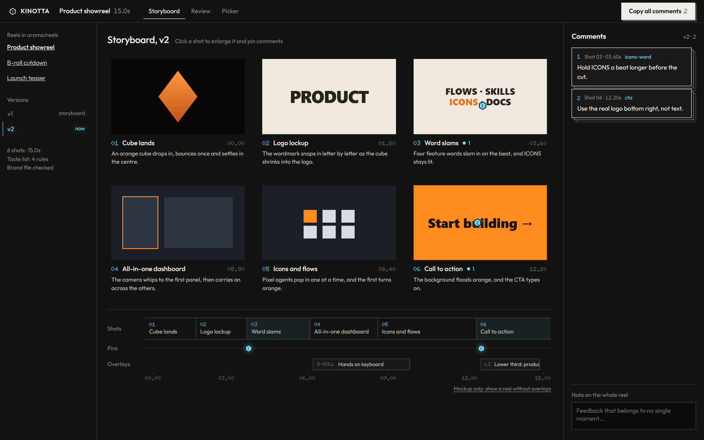
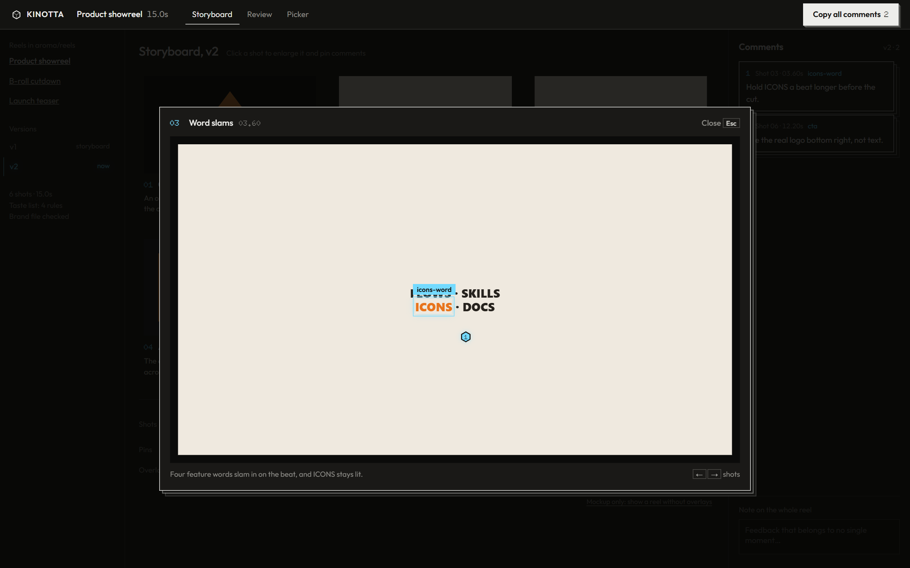
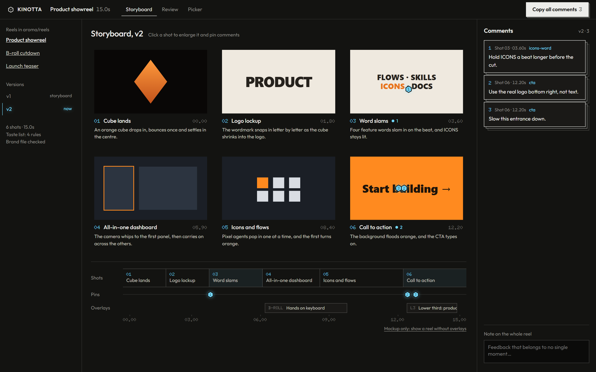
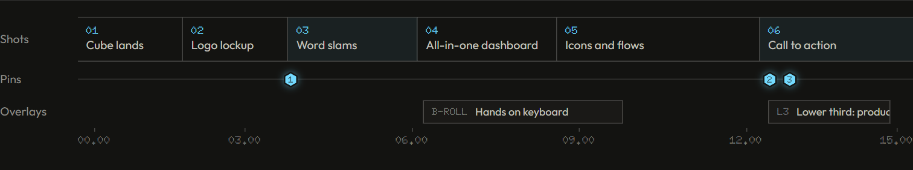
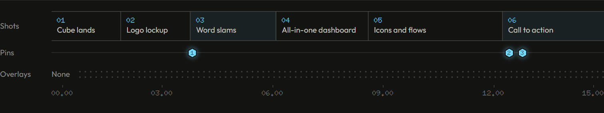
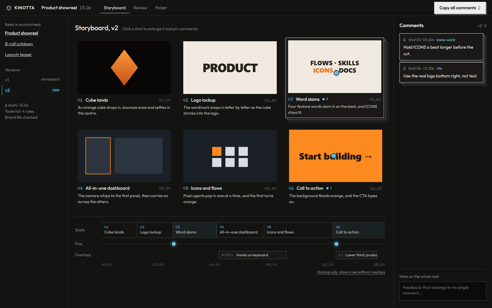

# Kinotta

A review editor for AI-made motion graphics and footage edits. Claude builds a reel inside your
project, you pin comments to the exact element in a frame, and Claude builds the next version from
your comments.

> **Status: design stage.** There is no code yet. The screenshots below are from the approved
> interactive mockup, and the demo reel in them is synthetic. The first phase to be built is the
> Storyboard, specified in [issue #1](https://github.com/RayDomD/kinotta/issues/1).



## How it works

1. You ask Claude, inside any project, for a reel. It records the project's brand sources once in
   `reels/brand.md` and reads your taste list before every build.
2. Claude writes a **storyboard**: every scene built in its final look but not yet animated, plus a
   shot list. It's version 1.
3. You open the reel in Kinotta. Every shot is the live page paused at that moment, not a
   screenshot.
4. You click a shot, hover to see which named element a click will land on, and pin a comment to
   it.
5. **Copy all comments** puts the batch on your clipboard and saves it next to the version. You
   paste it into Claude.
6. Claude builds the next version as a new frozen folder. Kinotta shows it as ready, and the
   previous version and its comments stay as history.

This works because every version follows a **timing contract**: timed scenes, named elements, and a
jump to any second. See [ADR 0001](docs/adr/0001-timing-contract.md).

## Install

Run these in this repo once (Node 20 or later):

```
npm install
npm link
npm run install-skill
```

`npm link` puts the `kinotta` command on your PATH. Open a new terminal afterwards so it is found.
`npm run install-skill` links the skill in [`skill/kinotta/`](skill/kinotta/SKILL.md) into
`~/.agents/skills/kinotta`, and that folder into `~/.claude/skills/kinotta` where Claude Code finds
it. Both are Windows junctions (symlinks elsewhere), so editing the skill here updates it everywhere.

Then, inside any project:

- Ask Claude for a reel. The skill writes `reels/brand.md` on first use and stops for you to check it.
- `kinotta` opens the editor on the project's `reels/` folder.
- `kinotta check <reel> [version]` prints a version's contract issues and exits non-zero when there
  are any. Claude runs it before saying a version is ready.

## Screens

### Pin the element, not just the pixel

The element under the cursor is outlined and named before you click, so feedback like "make this
darker" is never ambiguous.



### Comments you can hand off

Each comment records its shot, time and element. Numbered hex pins match across the frame, the
grid, the timeline and the list.



### Pacing at a glance

Under the grid, three lanes share one time axis. Each shot's width is its duration, pins sit at
their moment, and overlays are drawn at their real span.





### Shots you pick up

The editor chrome stays flat and quiet so the reel is the only colour on screen. A shot lifts into
stacked paper only when it's in your hand.



## Design

The visual world comes from the Rubric brand: a warm near-black ground, a single ice-blue light
for pins and current state, Outfit with Doto for numbers and timecodes, square corners, a hex
cursor and hex pins. Decisions D15 to D22 are in
[the grilling log](docs/2026-09-30-grilling-decisions.md), and the clickable mockup is
[docs/mockups/2026-09-30-editor-visual-world.html](docs/mockups/2026-09-30-editor-visual-world.html).

## Planned stack

A local web app: a Node server plus a React, TypeScript and Vite UI, started from inside the
project whose reels you are reviewing. The server logic stays independent of HTTP so Electron can
wrap it later.

## Docs

| Doc | What it holds |
|---|---|
| [CONTEXT.md](CONTEXT.md) | Glossary: reel, version, storyboard, shot, pin, comment batch and more |
| [PRODUCT.md](PRODUCT.md) | Users, purpose, positioning and constraints |
| [Grilling decisions](docs/2026-09-30-grilling-decisions.md) | Product and design decisions D1 to D22 |
| [ADRs](docs/adr/) | The timing contract, and why Kinotta runs inside your projects |
| [Storyboard spec](docs/specs/2026-09-30-storyboard-phase.md) | The first phase, as user stories and build decisions |
| [Plans](docs/plans/) | Plans with status. Open `index.html` for the dashboard |

## Roadmap

Storyboard, then Review (animated playback, scrubbing, footage and overlays), then Picker. The MP4
render, audio comments and trimming come with the later phases.
